# Westwood FRC Wiring Guide (2018-2019)

<!-- Author: Joshua Budd -->
<!-- Date: 2019/01/23 -->
<!-- Revised: 2019/11/04 -->

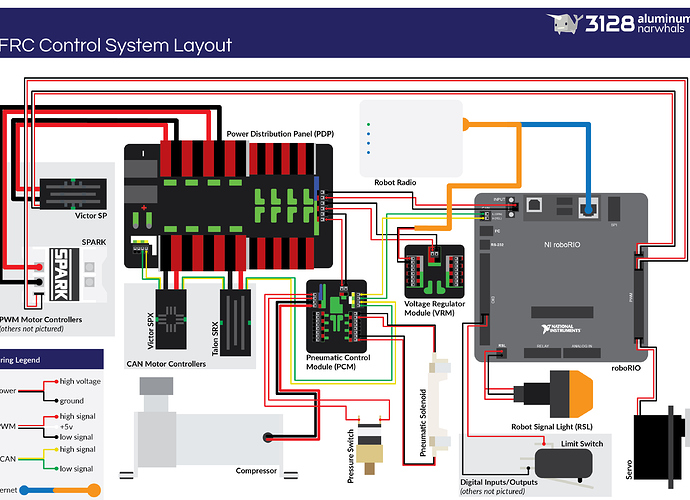

## Table of Contents

* [Battery & Breaker](#battery)
* [PDP](#pdp)
* [RoboRIO](#rio)
* [VRM](#vrm)
* [PCM](#pcm)
* [Radio](#radio)
* [PoE](#poe)
* [Talon](#talon)
* [RSL](#rls)
* [DIO](#dio)
* [Encoder](#encoder)
* [IR Sensor](#ir)
* [Hall Effect Sensor](#halleffect)
* [Pulse-Width Modulation](#pwm)
* [REV Blinkin](#leds)
* [CAN Wiring](#can)
* [Wire Gauge](#gauge)

## Battery & Breaker
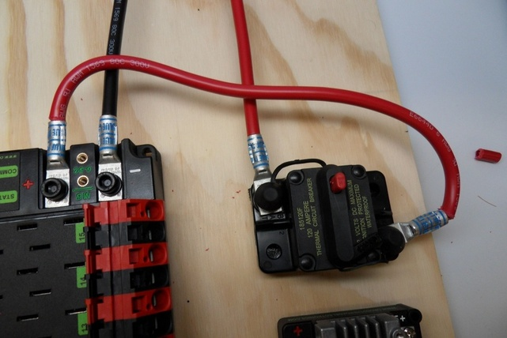

* **Negative** lead goes to [PDP](#pdp)
* **Positive** lead goes to breaker
    * Attaches to side reading "THERMAL CIRCUIT BREAKER"

## Power Distribution Panel (PDP)
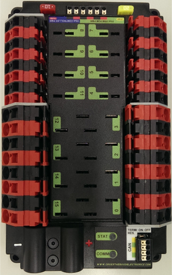

(Down is the side with the power ports.)

* **Red** 10 Amp breaker in top left
    * [RoboRIO](#rio) goes in **blue** "Vbat CONTROLLER POWER"
* **Yellow** 20 Amp breaker in top right
    * [VRM](#vrm) and [PCM](#pcm) goes in **green** "Vbat VRM PCM PWR"
* ports (0, 1, 3, 4, 12, 13, 14, 15):
    * 40 Amp breaker
    * [Talons](#talon) plug in here
* ports (4, 5, 6, 7, 8, 9, 10, 11):
    * 5, 20, or 30 Amp breakers
    * Camera plugs in here
* [CAN](#can) Cable in CAN (bottom right):
    Jumper switch must be in ON position

## RoboRIO

(Up is the the side with the USB ports.)

* 22 guage Power Cable in INPUT (left of USB ports)
    * **Positive** goes in V
    * **Negative** goes in C
* [CAN](#can) Cable in CAN (left of power cable)
    * **Yellow** goes in H
    * **Green** goes in L
* [DIO](#dio) sensors in DIO (left side)
    * Boolean sensors go in DIO ports (Boolean sensors are sensors with only on and off states.)
    * (e.g. Infrared sensors, limit switches)
    * Begin plugging in sensors at 0 and count up (not required, good wiring practice)
* [PWM](#pwm) sensors in PWM (right side)
    * Analog sensors go in PWM ports (Analog sensors are sensors with a range of outputs)
    * (e.g. ultrasonic sensors, potentiometers)
    * Some motor controllers and the Blinkin go in PWM ports
    * Begin plugging in sensors at 0 and count up
* [RSL](#rsl) light in RSL (left-most bottom port)
    * **Positive** goes in S
    * **Negative** goes in ground (the dashed lines)
* NavX in MXP (center)
    * NavX gyroscope is mounted with majority of sensor closer to USB ports

## Voltage Regulator Module (VRM)

(Down is the side with the 12V and 5V lights)

* Power Cables in 12V (top)
* 12V/2A (upper left)
    * [Radio](#radio) Power (circular plug)
    * [PoE](#poe) Power

## Pneumatic Control Module (PCM)
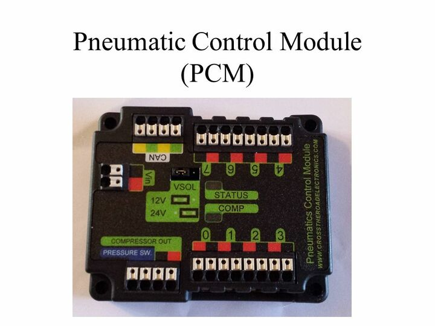

(Left is the side with the Vin)

* [PCM](#pcm) power in Vin (left)
* [CAN](#can) Cable in CAN (top left)
* Pressure Meter Power in **blue** PRESSURE SW.
* Air compressor Power in **green** COMPRESSOR OUT
* ports (0, 1, 2, 3, 4, 5, 6, 7)
    * Solenoid Power goes here

## Radio (OM5P-AC)
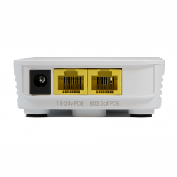

* Radio Power circular plug in left
* Camera ethernet in middle (not required)
* [RoboRIO](#rio) ethernet in right

### Power over Ethernet (PoE)
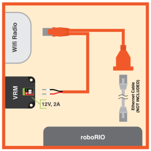

* PoE power goes in [VRM](#vrm) in same spot as circular plug
* PoE ethernet goes in middle in the radio
* PoE female end goes to Camera unlike in diagram

## Talon SRX & Victor
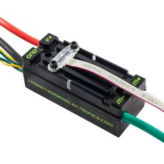

* Talon & Victor power are red and black
    * plug in 40 Amp PDP port
    * ***DO NOT PLUG INTO MOTORS***
* Motor Power is green and white
* Talon only: Encoder data cable on top, covered with hex screws & plastic cover 

## Robot Signal Light (orange RSL)
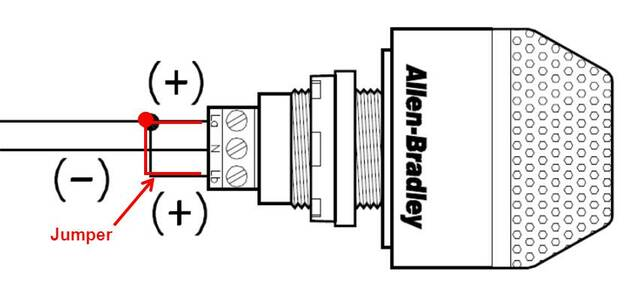

* Power cable from [RoboRIO](#rio)
    * **Positive** in La and Lb
    * **Negative** in N

## Digital Input and Output (DIO)
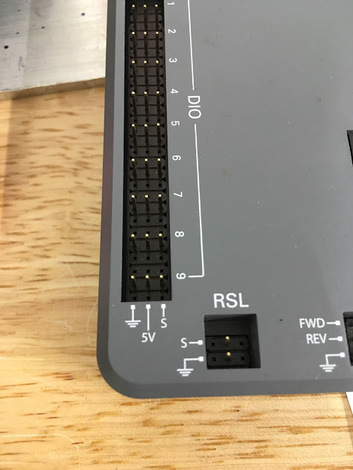

* Ports labled 0 through 9 on [RoboRIO](#rio)
* All digital sensors go in DIO ports
* Begin plugging in sensors at 0 and count up (not required, good wiring practice)

### Grayhill Encoder
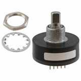

(Up is the direction so DIO and the numbers are upside up)

* ***DO NOT RELY ON COLORS OF DIO CABLES***
* DO NOT BEND PINS
* Encoder has 5 pins labeled `B + A _ G` (\_ is blank)
* On 5 pin cable, connect to encoder so the missing wire goes to the \_
* On 3 pin cable, connect to [RIO](#rio) so G is on the ground (bottom pin) of an EVEN position (not required wiring practice)
* On 2 pin cable, connect to RIO so signal (A or B) is on S (top pin) of the NEXT position (not required, good wiring practice)
* (e.g. if 3 pin cable is in position 4, the 2 pin cable goes in position 5)
* There are 128 clicks in a rotation

### IR Sensor
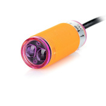

(Up is the direction so DIO and the numbers are upside up)

* **Blue** or **Green** cable from sensor goes in ground (bottom pin)
* **Brown** or **Red** cable from sensor goes in positive (middle pin)
* **Black** or **Yellow** cable from sensor goes in signal (top pin)

### Hall Effect Sensor
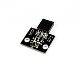

(Up is the direction so DIO and the numbers are upside up)

* The Hall Effect Sensor detects whether there is a magnet nearby the sensor (using the Hall Effect)
* **GND** on the sensor goes in ground (bottom pin)
* **5V** on the sensor goes in the positive (middle pin)
* **SIG** on the sensor goes in signal (top pin)

### Pulse-Width Modulation (PWM)
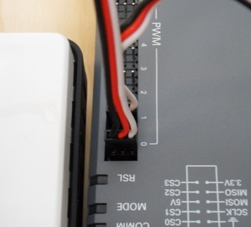

* Ports labeled from 0 through 9 on [RoboRio](#rio)
* All analog sensors and some controllers go in PWM ports
* Begin plugging in sensors at 0 and count up (not required, good wiring practice)

### REV Blinkin
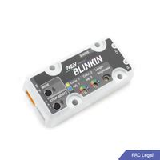

* Rated for 12V/5A
* **~** is the signal PWM and is closest to the power wires on the Blinkin
* **~** goes in the signal on the rio which is closes to the center of the rio
* Specific documentation can be found [here](./REV-11-1105-UM.pdf)

---

### CAN LOOP Instructions

* Start CAN at [PDP](#pdp)
* Connect through all [Talons](#talon), Victors, and [PCM](#pcm)
* End CAN at [RoboRIO](#rio)

### Wiring Gauge guide

* 22 gauge:
    * [CAN](#can) Loop
    * [VRM](#vrm) Power
    * [PCM](#pcm) Power
    * [Radio](#radio) Power
    * [RoboRIO](#rio) Power
    * [RSL](#rsl) Power
* 16 gauge:
    * [Talon](#talon) Power
    * Victor Power
    * Motor Power
* 6 gauge:
    * [Battery](#battery) Power
    * Breaker Power
